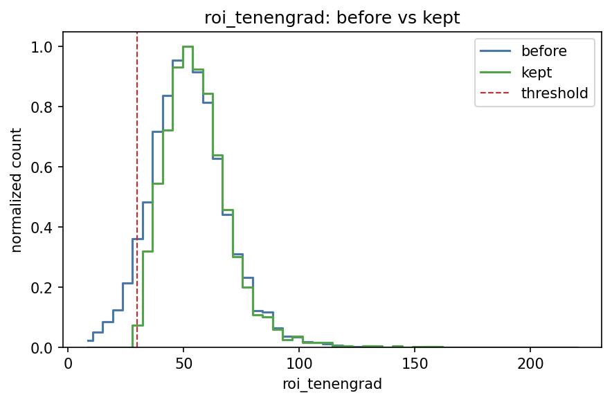
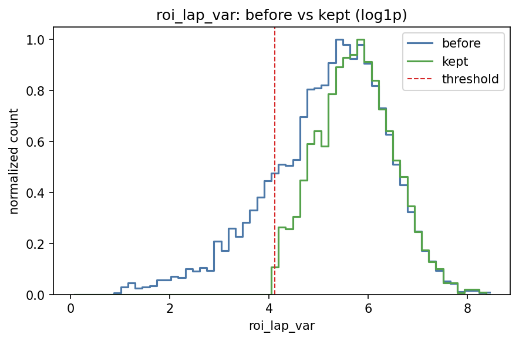
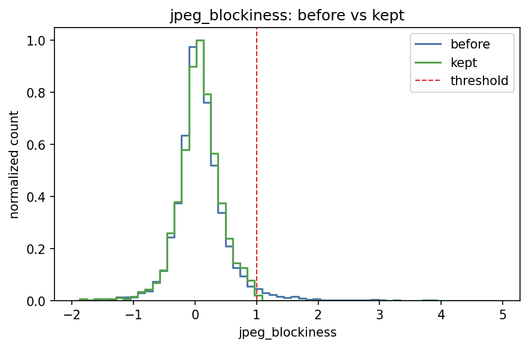
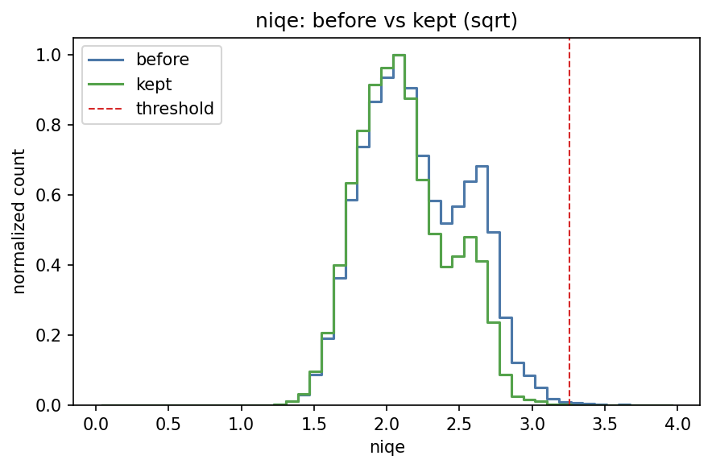
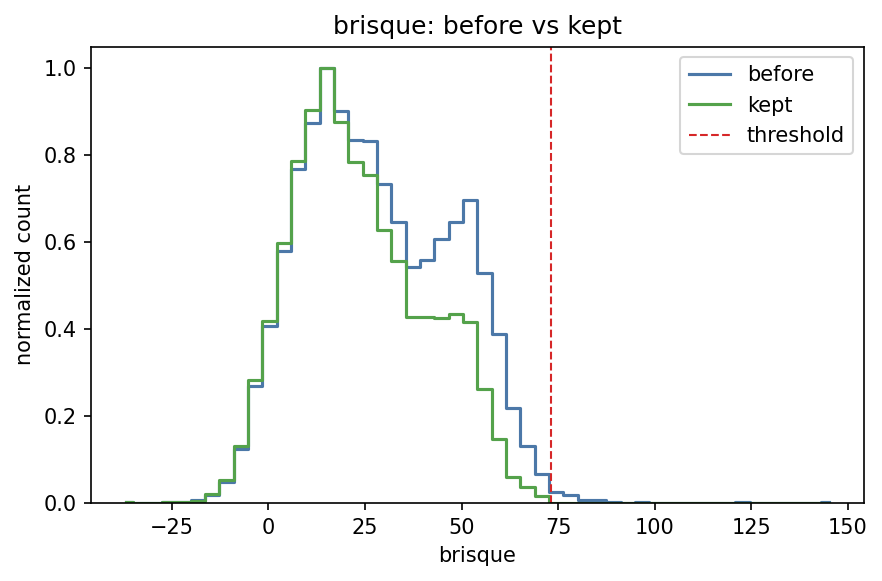
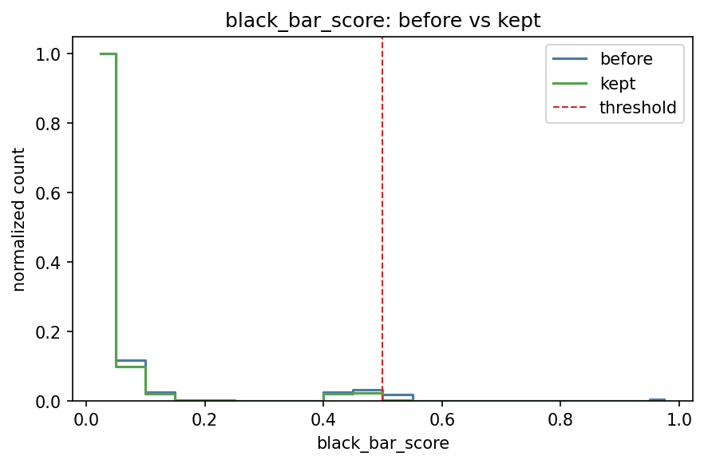
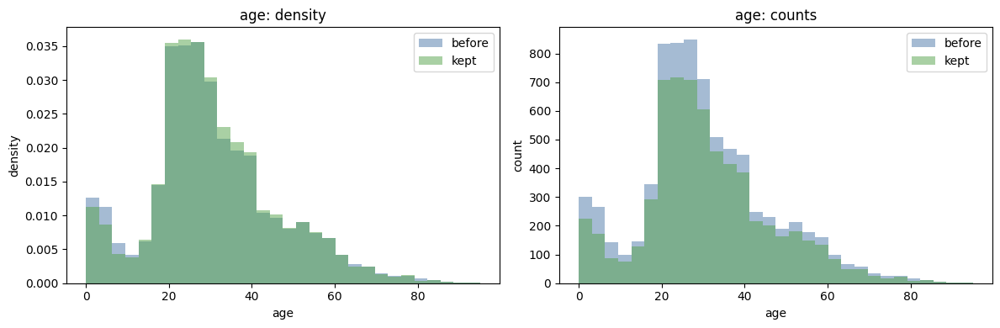
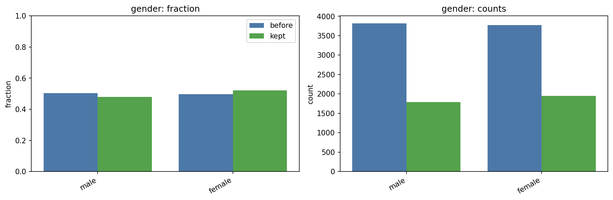
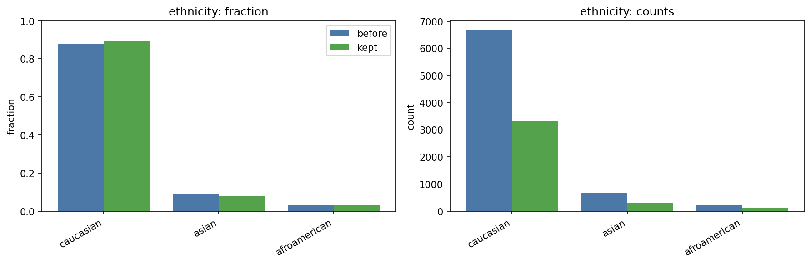
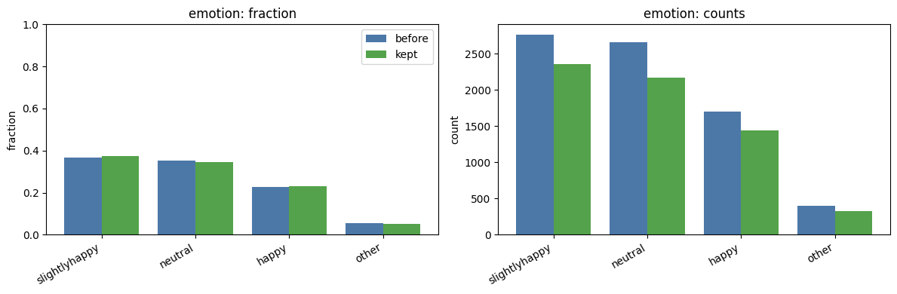

# Diffusion RLHF for Attribute-Conditioned Portraits

This repo builds a Stable Diffusion LoRA that follows prompts describing **age, gender, ethnicity, and emotion**, then improves results with **human preference data** (RLHF/DPO). The project focuses on:
- Curating a clean, labeled face dataset.
- Training a base LoRA on text-conditioned labels.
- Generating A/B samples for human rating.
- (Planned) Preference tuning with a latent-space DPO loss.

## Quick start
From repo root:
```bash
python -m venv .venv
source .venv/bin/activate
pip install -U pip
pip install opencv-contrib-python numpy pandas pillow matplotlib tqdm torch pyiqa piq jupyter
```

`datasets/appa-real-dataset_v2_improved` is already included in the repo, so you can proceed directly to base LoRA training.

Optional: rebuild the cleaned dataset yourself.
1) Use `0_dataset_download.ipynb` to fetch and assemble the raw APPA-REAL dataset.
2) Run the dataset quality pipeline:
```bash
python -m dataset_quality.pipeline \
  --dataset-root datasets/appa-real-dataset_v2 \
  --output-root datasets/appa-real-dataset_v2_improved
```

Open the review notebook:
```bash
jupyter lab
```
Then run:
- `0_dataset_quality_enhance.ipynb`
- `0_dataset_quality_review.ipynb`

## Repository map (what to look at)

### Dataset quality (cleaning + analysis)
- `dataset_quality/` — modular pipeline (metrics, rules, reporting).
- `0_dataset_quality_enhance.ipynb` — runs the pipeline.
- `0_dataset_quality_review.ipynb` — visual review, metric distributions, label distributions.

### Base LoRA training
- `1_diffusion_rl_base.ipynb` — local training notebook.
- `1_diffusion_rl_base_colab_v2.ipynb` — Colab version.

### Training notes
- Base LoRA training resizes with bicubic interpolation and crops to 512 without aspect-ratio distortion.
- Training history logs both train and validation loss in `lora_training_runs/*/training_history.json`.
- Checkpoint selection follows validation loss when available.
- Dataset quality pipeline drops the worst 20% by composite badness score (configurable in `dataset_quality/config.py`).
- Dataset quality metrics are cached under `datasets/appa-real-dataset_v2_improved/reports/` when inputs/config match.

### RLHF data generation + rating
- `2_generate_prompts.ipynb` — prompt grid builder.
- `3_0_generate_sample_image.ipynb` — single prompt inference.
- `3_1_diffusion_sample_rlhf.ipynb` — A/B sample generation + latents.
- `4_hf_rating.ipynb` — human rating UI.
- `ratings_interface/` — generated samples + ratings JSONL.

## Dataset
We start from:
- `datasets/appa-real-dataset_v2` (original labeled dataset)

We produce a cleaned dataset at:
- `datasets/appa-real-dataset_v2_improved`
This cleaned dataset is the training source for the base LoRA (same layout as `datasets/appa-real-dataset_v2`). It is already uploaded to GitHub, so you can train immediately without downloading raw zips.

### Optional: download and rebuild the initial dataset
Use `0_dataset_download.ipynb` to download both zips (APPA-REAL images + metadata) and rebuild `datasets/appa-real-dataset_v2`.

APPA-REAL images:
`https://data.chalearnlap.cvc.uab.cat/AppaRealAge/appa-real-release.zip`
All-categories metadata:
`http://sergioescalera.com/wp-content/uploads/2018/06/allcategories_trainvalidtest_split.zip`

Place the extracted dataset folder here:
`datasets/appa-real-dataset_v2`

Expected layout:
```bash
.
├── datasets
│   └── appa-real-dataset_v2
│       ├── test_data
│       ├── train_data
│       ├── valid_data
│       ├── labels_metadata_test.csv
│       ├── labels_metadata_train.csv
│       └── labels_metadata_valid.csv
```

For this project we only keep:
- `*.jpg` images
- `datasets/appa-real-dataset_v2/labels_metadata_test.csv`
- `datasets/appa-real-dataset_v2/labels_metadata_train.csv`
- `datasets/appa-real-dataset_v2/labels_metadata_valid.csv`

The original zip is ~844 MB; the reduced (unfiltered) dataset is ~130 MB.

The improved dataset is rebuilt by filtering low-quality images based on:
- Sharpness (Laplacian variance + Tenengrad)
- Compression artifacts (JPEG blockiness)
- NR-IQA (NIQE + BRISQUE)
- Black bars (solid border bars)

### APPA-REAL dataset citations
Source: https://chalearnlap.cvc.uab.cat/dataset/26/description/

> **APPA-REAL DATABASE**  
> The APPA-REAL database contains 7,591 images with associated real and apparent age labels. The total number of apparent votes is around 250,000. On average we have around 38 votes per each image and this makes the average apparent age very stable (0.3 standard error of the mean).  
>  
> The images are split into 4113 train, 1500 valid and 1978 test images, provided in the folders train/, valid/ and test/. For each image X.jpg, we also provide a corresponding X.jpg_face.jpg which contains the cropped & rotated face with a 40% margin obtained from the Mathias et. al face detector (http://markusmathias.bitbucket.org/2014_eccv_face_detection/) at multiple rotations. Furthermore, an X.jpg.mat file is provided with meta-information about the detected face.  
>  
> The real age and apparent age ratings are provided in the files gt_train.csv, gt_test.csv and gt_valid.csv, with a separate row for each rating.  
>  
> Furthermore, we provide per-image summaries in gt_avg_train.csv, gt_avg_valid.csv and gt_avg_test.csv, showing the number of ratings, average apparent age, standard deviation of apparent age and the real age for each image. A comparison of Age datasets characteristics is shown in the table 1.

BibTeX:
```bibtex
@inproceedings{agustsson2017appareal,
  title={Apparent and real age estimation in still images with deep residual regressors on APPA-REAL database.},
  author={E Agustsson, R Timofte, S Escalera, X Baro, I Guyon, R Rothe.},
  booktitle={12th IEEE International Conference and Workshops on Automatic Face and Gesture Recognition (FG), 2017},
  year={2017},
  organization={IEEE}
}

@inproceedings{clapes2018apparent,
  title={From apparent to real age: gender, age, ethnic, makeup, and expression bias analysis in real age estimation},
  author={Clap{\'e}s, Albert and Bilici, Ozan and Temirova, Dariia and Avots, Egils and Anbarjafari, Gholamreza and Escalera, Sergio},
  booktitle={Proceedings of the IEEE Conference on Computer Vision and Pattern Recognition Workshops},
  pages={2373--2382},
  year={2018}
}
```

## Quality distributions (before vs kept)
These plots are generated from `datasets/appa-real-dataset_v2_improved/reports/quality_report.csv` via `0_dataset_quality_review.ipynb` and saved under `figures/`.

- `figures/roi_tenengrad.png`: ROI Tenengrad sharpness distribution (before vs kept).
  
- `figures/roi_lap_var.png`: ROI Laplacian variance distribution (before vs kept, log1p).
  
- `figures/jpg_blockiness.png`: JPEG blockiness distribution (before vs kept).
  
- `figures/niqe.png`: NIQE distribution (before vs kept, sqrt).
  
- `figures/brisque.png`: BRISQUE distribution (before vs kept).
  
- `figures/bar_score.png`: Black-bar score distribution (before vs kept).
  
- `figures/age.png`: Age distribution (before vs kept).
  
- `figures/gender.png`: Gender distribution (before vs kept, fraction).
  
- `figures/ethnicity.png`: Ethnicity distribution (before vs kept, fraction).
  
- `figures/emotion.png`: Emotion distribution (before vs kept, fraction).
  

## Outputs
- Cleaned dataset: `datasets/appa-real-dataset_v2_improved/`
- Reports: `datasets/appa-real-dataset_v2_improved/reports/`
  - `quality_report.csv`
  - `kept_images.csv`
  - `dropped_images.csv`
  - `drop_reason_counts.csv`

## Latest cleaning stats (2026-01-29)
- Source: `datasets/appa-real-dataset_v2_improved/reports/quality_report.csv`.
- Total images: 7,591; kept: 3,735; dropped: 3,856 (50.80%).
- Worst-quality percentile drop: 1,394 (18.36%), weighted toward NIQE/BRISQUE (2.0) over other metrics (0.5), **stratified by 5-year age bins** with a minimum keep of 200 per bin.
- Additional drop reasons (non-exclusive counts): brisque 2,614; niqe 2,366; roi_blur_laplacian 1,410; roi_blur_tenengrad 587; black_bars_score 494; jpeg_blockiness 238; black_bars_area 109.
- Current NR-IQA thresholds: NIQE max 5.76 (sqrt 2.4), BRISQUE max 36.5 (see `dataset_quality/config.py`).

## Notes on NIQE/BRISQUE
- NIQE is computed with `pyiqa` (CPU).
- BRISQUE uses `opencv-contrib-python` if model files exist, otherwise falls back to `piq`.
- If you want OpenCV BRISQUE, place model files at:
  - `models/brisque_model_live.yml`
  - `models/brisque_range_live.yml`
